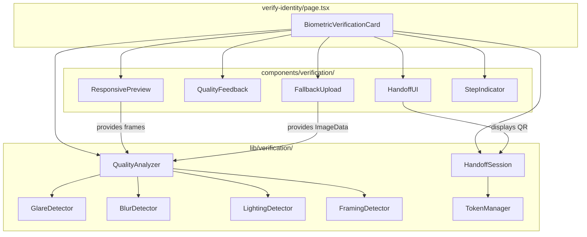
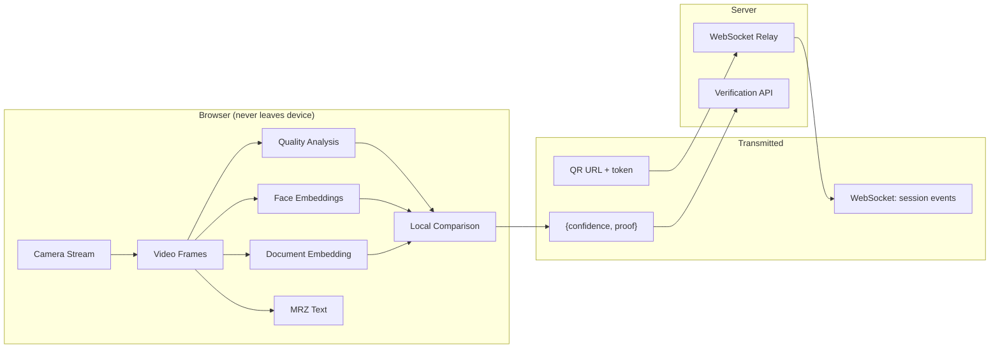

# Design Document: Passport Capture UX Improvements

## Overview

This design refactors the monolithic `BiometricVerificationCard` (~1181 lines) into a modular component architecture and introduces four new capabilities: responsive preview sizing, real-time glare detection, mobile handoff for desktop users, and pre-OCR quality feedback — all while maintaining the existing privacy guarantee that no biometric data leaves the device.

The core architectural change is extracting the verification pipeline into composable modules: a `QualityAnalyzer` for image quality assessment, a `HandoffSession` manager for desktop-to-mobile delegation, and a `ResponsivePreview` component that replaces the fixed `max-w-sm` camera view.

**Key design decisions:**
- **WebSocket for handoff signaling** — chosen over polling (latency) and WebRTC data channels (complexity of NAT traversal for a simple JSON payload). A lightweight WebSocket relay transmits only `{confidence, proof}` and session lifecycle events.
- **Canvas-based quality analysis** — all quality checks (glare, blur, lighting, framing) operate on `ImageData` from a hidden canvas, keeping the video stream unblocked.
- **Shared pipeline for camera and upload** — the `QualityAnalyzer` accepts either a video frame or an uploaded `File`, ensuring identical validation regardless of input source.

## Architecture

### Component Decomposition



### Data Flow: What Stays Local vs. What Crosses the Network



### Responsive Layout Approach

The `ResponsivePreview` component replaces the current `CameraPreview` with responsive sizing:

- **Desktop (viewport > 768px):** `width: clamp(640px, 80vw, 800px)` — ensures the preview is always between 640–800px regardless of container width.
- **Mobile (viewport ≤ 768px):** `width: calc(100vw - 48px)` — full width minus 24px padding on each side.
- **Aspect ratio:** Enforced via `aspect-ratio: 3/2` CSS property with a `padding-bottom` fallback for older browsers.
- **Resize handling:** Uses `ResizeObserver` on the container element. The video element's dimensions are CSS-driven, so resizing is instantaneous without re-requesting the stream.

## Components and Interfaces

### QualityAnalyzer Module

```typescript
// lib/verification/quality-analyzer.ts

export interface QualityCheckResult {
  passed: boolean;
  issues: QualityIssue[];
}

export type QualityIssueType = 'blur' | 'glare' | 'lighting' | 'framing';

export interface QualityIssue {
  type: QualityIssueType;
  message: string;       // User-facing remediation message (Spanish)
  severity: number;      // 0–1 normalized severity
}

export interface QualityAnalyzerConfig {
  glare: {
    luminanceThreshold: number;   // default: 240
    areaPercentage: number;       // default: 0.03 (3%)
  };
  blur: {
    laplacianVarianceThreshold: number;  // default: 100
  };
  lighting: {
    meanLuminanceThreshold: number;      // default: 80
  };
  framing: {
    edgeCoverageThreshold: number;       // default: 0.60 (60%)
  };
}

export interface GuideRect {
  x: number;
  y: number;
  width: number;
  height: number;
}

/**
 * Analyzes a frame (from camera or uploaded file) for quality issues.
 * All processing is synchronous on ImageData — no network calls.
 */
export function analyzeFrame(
  imageData: ImageData,
  guideRect: GuideRect,
  config?: Partial<QualityAnalyzerConfig>
): QualityCheckResult;

/**
 * Real-time glare detection for the streaming preview.
 * Returns true if glare is detected (luminance > threshold over > areaPercentage).
 */
export function detectGlare(
  imageData: ImageData,
  guideRect: GuideRect,
  config?: { luminanceThreshold?: number; areaPercentage?: number }
): boolean;

/**
 * Blur detection via Laplacian variance on grayscale image.
 */
export function detectBlur(
  imageData: ImageData,
  guideRect: GuideRect,
  config?: { varianceThreshold?: number }
): { blurry: boolean; variance: number };

/**
 * Lighting detection via mean luminance.
 */
export function detectLighting(
  imageData: ImageData,
  guideRect: GuideRect,
  config?: { meanThreshold?: number }
): { tooDark: boolean; meanLuminance: number };

/**
 * Framing detection via Canny edge coverage of guide perimeter.
 */
export function detectFraming(
  imageData: ImageData,
  guideRect: GuideRect,
  config?: { coverageThreshold?: number }
): { framingIssue: boolean; edgeCoverage: number };
```

### GlareDetector Algorithm

```typescript
// lib/verification/glare-detector.ts

/**
 * Algorithm:
 * 1. Extract pixels within guideRect from ImageData
 * 2. Convert each pixel to luminance: Y = 0.299*R + 0.587*G + 0.114*B
 * 3. Count pixels where Y > luminanceThreshold (default 240)
 * 4. If count / totalGuidePixels > areaPercentage (default 0.03), glare detected
 *
 * For real-time streaming: runs on every requestAnimationFrame tick,
 * operating on a downscaled canvas (320px wide) for performance.
 */
export function detectGlareInRegion(
  pixels: Uint8ClampedArray,
  width: number,
  height: number,
  luminanceThreshold: number,
  areaPercentage: number
): boolean;
```

### BlurDetector Algorithm

```typescript
// lib/verification/blur-detector.ts

/**
 * Algorithm:
 * 1. Extract guide region and convert to grayscale
 * 2. Apply 3x3 Laplacian kernel: [[0,1,0],[1,-4,1],[0,1,0]]
 * 3. Compute variance of the Laplacian response
 * 4. If variance < threshold (default 100), image is blurry
 *
 * The Laplacian highlights edges; a blurry image has low edge variance.
 */
export function computeLaplacianVariance(
  grayscale: Uint8Array,
  width: number,
  height: number
): number;
```

### FramingDetector Algorithm

```typescript
// lib/verification/framing-detector.ts

/**
 * Algorithm:
 * 1. Extract guide region and convert to grayscale
 * 2. Apply Gaussian blur (σ=1.4) to reduce noise
 * 3. Compute gradient magnitude and direction (Sobel operators)
 * 4. Non-maximum suppression along gradient direction
 * 5. Double threshold + hysteresis (Canny)
 * 6. Sample perimeter pixels of guide rect (every 2px)
 * 7. Count perimeter samples that are within 5px of a detected edge
 * 8. If count / totalPerimeterSamples >= 0.60, framing is acceptable
 */
export function computeEdgeCoverage(
  grayscale: Uint8Array,
  width: number,
  height: number,
  guidePerimeter: { x: number; y: number }[]
): number;
```

### HandoffSession Module

```typescript
// lib/verification/handoff-session.ts

export interface HandoffToken {
  token: string;          // 32-byte random, base64url-encoded
  createdAt: number;      // Date.now()
  expiresAt: number;      // createdAt + 300_000 (5 minutes)
  used: boolean;
}

export interface HandoffResult {
  confidence: number;
  proof: string;
}

export type HandoffStatus =
  | { kind: 'waiting' }
  | { kind: 'connected' }
  | { kind: 'completed'; result: HandoffResult }
  | { kind: 'expired' }
  | { kind: 'error'; message: string };

/**
 * Creates a new handoff session. Returns the token and a URL to encode in QR.
 */
export function createHandoffSession(): {
  token: HandoffToken;
  url: string;
};

/**
 * Validates a token: not expired AND not used.
 */
export function isTokenValid(token: HandoffToken): boolean;

/**
 * Desktop side: connects to WebSocket relay and listens for mobile result.
 * Returns an observable-like interface for status updates.
 */
export function listenForHandoffResult(
  token: HandoffToken,
  onStatusChange: (status: HandoffStatus) => void
): { disconnect: () => void };

/**
 * Mobile side: sends {confidence, proof} to the relay for the given token.
 * The relay forwards it to the desktop listener, then invalidates the token.
 */
export function sendHandoffResult(
  token: string,
  result: HandoffResult
): Promise<void>;
```

### WebSocket Relay Protocol

The relay is a minimal server that:
1. Desktop opens `wss://relay.example.com/handoff/{token}` with role `desktop`
2. Mobile opens same URL with role `mobile`
3. Mobile sends `{ type: "result", confidence, proof }`
4. Relay forwards to desktop, then closes both connections
5. Relay rejects connections if token is expired or already used

Messages are JSON with a `type` field:
- `{ type: "connected", role: "mobile" }` — relay → desktop when phone connects
- `{ type: "result", confidence: number, proof: string }` — mobile → relay → desktop
- `{ type: "expired" }` — relay → both when token expires
- `{ type: "error", message: string }` — relay → sender on invalid state

**Security model:**
- Token is 32 bytes of `crypto.getRandomValues`, base64url-encoded (256 bits of entropy)
- Single-use: relay deletes token after first successful result delivery
- 5-minute TTL enforced server-side (client TTL is advisory)
- No biometric data in protocol — relay can be untrusted since it only sees `{confidence, proof}`
- HTTPS/WSS only — no plaintext transport

### ResponsivePreview Component

```typescript
// components/verification/responsive-preview.tsx

export interface ResponsivePreviewProps {
  videoRef: React.RefObject<HTMLVideoElement | null>;
  showIdGuide?: boolean;
  mirrored?: boolean;
  glareDetected?: boolean;
  glareMessage?: string;
  qualityIssues?: QualityIssue[];
  onFrameAvailable?: (imageData: ImageData, guideRect: GuideRect) => void;
  ariaLiveMessage?: string;
}

/**
 * Responsive video preview with:
 * - 640–800px on desktop, full-width on mobile
 * - 3:2 aspect ratio
 * - Optional ID guide overlay
 * - Glare warning overlay
 * - Quality feedback overlay
 * - ARIA live region for screen reader announcements
 */
```

### FallbackUpload Component

```typescript
// components/verification/fallback-upload.tsx

export interface FallbackUploadProps {
  onFileSelected: (imageData: ImageData) => void;
  acceptedTypes: string[];   // ['image/jpeg', 'image/png']
  maxSizeMB: number;         // 10
  qualityIssues?: QualityIssue[];
  onRetry: () => void;
}

/**
 * File upload interface shown when camera is unavailable.
 * - Accepts JPEG/PNG up to 10MB
 * - Renders uploaded image in the same ResponsivePreview frame
 * - Runs QualityAnalyzer on the uploaded image
 * - Shows remediation messages on failure
 * - Allows re-upload
 * - Fully keyboard-navigable with visible focus indicators
 */
```

### HandoffUI Component

```typescript
// components/verification/handoff-ui.tsx

export interface HandoffUIProps {
  onResultReceived: (result: HandoffResult) => void;
  onExpired: () => void;
  onCancel: () => void;
}

/**
 * Desktop-side handoff interface:
 * - Generates and displays QR code (using a lightweight QR library)
 * - Shows countdown timer (5 minutes)
 * - Displays connection status (waiting → connected → completed)
 * - Handles expiration with option to regenerate
 */
```

## Data Models

### Session and Token State

```typescript
interface HandoffSessionState {
  token: HandoffToken;
  status: HandoffStatus;
  wsConnection: WebSocket | null;
  timeoutId: ReturnType<typeof setTimeout> | null;
}
```

### Quality Analysis State

```typescript
interface QualityState {
  glareDetected: boolean;
  lastAnalysis: QualityCheckResult | null;
  isAnalyzing: boolean;
  frameCount: number;        // For throttling real-time analysis
}
```

### BioState Extension

The existing `BioState` union type is extended with new states:

```typescript
type BioState =
  | { kind: "idle" }
  | { kind: "loading-models" }
  | { kind: "models-error"; message: string }
  | { kind: "liveness"; stage: "right" | "left" | "closer"; checks: LivenessChecks }
  | { kind: "liveness-failed" }
  | { kind: "id-instructions"; ready: boolean }
  | { kind: "id-streaming"; glareDetected: boolean }          // EXTENDED
  | { kind: "id-quality-failed"; issues: QualityIssue[] }     // NEW
  | { kind: "id-error"; message: string }
  | { kind: "handoff-active"; session: HandoffSessionState }  // NEW
  | { kind: "handoff-expired" }                                // NEW
  | { kind: "fallback-upload" }                                // NEW
  | { kind: "validating-document"; message: string }
  | { kind: "document-invalid"; message: string }
  | { kind: "comparing" }
  | { kind: "submitting" }
  | { kind: "verified"; confidence: number }
  | { kind: "no-match" }
  | { kind: "submit-error"; message: string };
```

### File Validation Model

```typescript
interface FileValidation {
  valid: boolean;
  error?: 'invalid-type' | 'too-large' | 'unreadable';
  file?: File;
  imageData?: ImageData;
}

const ACCEPTED_TYPES = ['image/jpeg', 'image/png'] as const;
const MAX_FILE_SIZE_BYTES = 10 * 1024 * 1024; // 10MB
```

## Correctness Properties

*A property is a characteristic or behavior that should hold true across all valid executions of a system — essentially, a formal statement about what the system should do. Properties serve as the bridge between human-readable specifications and machine-verifiable correctness guarantees.*

### Property 1: Responsive Preview Sizing

*For any* viewport width, the computed preview width SHALL be: if viewport > 768px then clamp(640, viewport * 0.8, 800); if viewport ≤ 768px then viewport - 48. The result is always a positive number within the expected bounds.

**Validates: Requirements 1.1, 1.2**

### Property 2: Aspect Ratio Invariant

*For any* computed preview width (regardless of viewport size), the preview height SHALL equal width × (2/3), maintaining the 3:2 aspect ratio within a tolerance of ±1px.

**Validates: Requirements 1.3**

### Property 3: Glare Detection Threshold

*For any* pixel array representing the guide region, the glare detector SHALL return `true` if and only if the proportion of pixels with luminance > 240 exceeds 3% of the total guide area pixels.

**Validates: Requirements 2.1**

### Property 4: Glare Spatial Filtering

*For any* video frame and guide rectangle, the glare detector SHALL produce the same result whether or not pixels outside the guide rectangle have high luminance — only pixels within the guide rectangle affect the detection outcome.

**Validates: Requirements 2.5**

### Property 5: Handoff Token Expiration

*For any* handoff token, `isTokenValid(token)` SHALL return `true` if and only if `token.used === false` AND `Date.now() < token.expiresAt` (where expiresAt = createdAt + 300,000ms).

**Validates: Requirements 3.2**

### Property 6: Handoff Payload Privacy

*For any* message transmitted between the mobile device and the desktop session during a handoff, the message payload SHALL contain only the fields `{confidence, proof, type}` and SHALL NOT contain any field representing image data, pixel arrays, face embeddings, or biometric descriptors.

**Validates: Requirements 3.4, 3.7**

### Property 7: Blur Detection Threshold

*For any* grayscale image region, the blur detector SHALL classify the image as blurry if and only if the variance of the Laplacian response is below 100.

**Validates: Requirements 4.2**

### Property 8: Lighting Detection Threshold

*For any* pixel array representing the guide region, the lighting detector SHALL classify the image as too dark if and only if the mean luminance (computed as 0.299R + 0.587G + 0.114B averaged over all pixels) is below 80.

**Validates: Requirements 4.3**

### Property 9: Framing Detection Threshold

*For any* edge map and guide perimeter, the framing detector SHALL classify framing as insufficient if and only if fewer than 60% of the perimeter sample points are within 5px of a detected edge.

**Validates: Requirements 4.4**

### Property 10: Quality Issue to Remediation Message Mapping

*For any* combination of quality check failures (blur, lighting, framing), the system SHALL produce exactly one remediation message per failing check, using the correct message text for each issue type, and SHALL NOT invoke OCR.

**Validates: Requirements 4.5**

### Property 11: File Upload Validation

*For any* file, the upload validator SHALL accept the file if and only if its MIME type is in `['image/jpeg', 'image/png']` AND its size is ≤ 10,485,760 bytes (10MB).

**Validates: Requirements 5.2**

## Error Handling

### Camera Access Errors

| Condition | Behavior |
|-----------|----------|
| `NotAllowedError` (permission denied) | Show `FallbackUpload` interface with explanation |
| `NotFoundError` (no camera) | Show `FallbackUpload` interface |
| `NotReadableError` (camera in use) | Show error message with retry option |
| Stream interrupted mid-capture | Retain last good frame, offer retry |

### Handoff Errors

| Condition | Behavior |
|-----------|----------|
| Token expired (5 min) | Show expiration message on both devices, offer new QR |
| WebSocket disconnected | Attempt reconnect (3 retries, 2s backoff), then show error |
| Invalid result payload | Reject silently, keep session open for retry |
| Mobile sends after desktop disconnects | Relay returns error to mobile, mobile shows "session ended" |

### Quality Analysis Errors

| Condition | Behavior |
|-----------|----------|
| Canvas context unavailable | Fall back to skipping quality checks, proceed to OCR |
| Analysis exceeds 500ms timeout | Return partial results (whichever checks completed) |
| Corrupt ImageData from upload | Show "Archivo no legible" error, allow re-upload |

### File Upload Errors

| Condition | Behavior |
|-----------|----------|
| Wrong MIME type | "Solo se aceptan archivos JPEG o PNG" |
| File too large (> 10MB) | "El archivo excede el límite de 10MB" |
| File unreadable | "No se pudo leer el archivo. Intenta con otro." |

## Testing Strategy

### Property-Based Tests

Property-based testing is appropriate for this feature because the core modules (QualityAnalyzer, GlareDetector, BlurDetector, LightingDetector, FramingDetector, token validation, file validation) are pure functions with clear input/output behavior and large input spaces.

**Library:** [fast-check](https://github.com/dubzzz/fast-check) — the standard PBT library for TypeScript/JavaScript.

**Configuration:**
- Minimum 100 iterations per property test
- Each test tagged with: `Feature: passport-capture-ux-improvements, Property {N}: {title}`

**Properties to implement:**
1. Responsive preview sizing (Property 1 + 2 combined into dimension computation tests)
2. Glare detection threshold (Property 3)
3. Glare spatial filtering (Property 4)
4. Token expiration logic (Property 5)
5. Handoff payload privacy (Property 6)
6. Blur detection threshold (Property 7)
7. Lighting detection threshold (Property 8)
8. Framing detection threshold (Property 9)
9. Quality → message mapping (Property 10)
10. File upload validation (Property 11)

### Unit Tests (Example-Based)

- Capture button disabled when glare detected (Req 2.4)
- QR code generation contains valid URL with token (Req 3.1)
- Desktop proceeds on valid handoff result (Req 3.5)
- Expired token shows message and allows regeneration (Req 3.6)
- Quality checks run before OCR invocation (Req 4.1)
- All checks pass → OCR proceeds (Req 4.6)
- Fallback UI shown when no camera (Req 5.1)
- Same pipeline for upload and camera (Req 5.3)
- ARIA live regions present (Req 5.4, 5.5)
- Keyboard navigation works (Req 5.6)
- Upload failure shows remediation + re-upload (Req 5.7)

### Integration Tests

- Resize adaptation within 100ms (Req 1.4)
- Glare overlay appears/disappears within 200ms (Req 2.2, 2.3)
- Quality analysis completes within 500ms (Req 4.7)
- Full handoff flow: QR → mobile connect → result → desktop proceeds
- Full camera capture flow: stream → quality check → OCR → comparison

### Accessibility Tests

- Screen reader announces quality warnings via `aria-live="polite"`
- All interactive elements have visible focus indicators
- Tab order is logical through the verification flow
- Fallback upload is fully operable without a mouse
